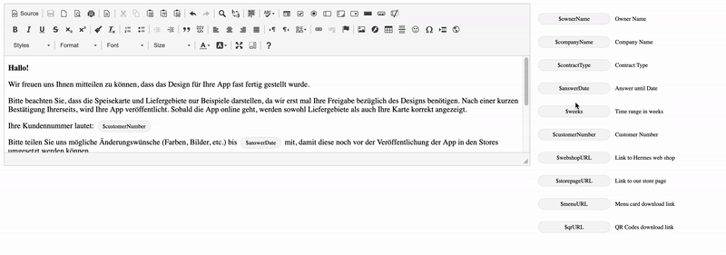

# angular-ckeditor-dragndrop

There is example of using **[CKEditor 4]** and **Angular 9** with implementation drag'n'drop feature from Angular component to CKEditor.

## Running example

Run `npm i` or `yarn` for installing dependencies. After that you can run `ng serve` or `yarn start` for a dev server. Navigate to `http://localhost:4200/`. 

## Implementation steps

1. Install dependency [ng2-ckeditor] (Angular2 CKEditor component)

[CKEditor 4]: https://ckeditor.com/docs/ckeditor4/latest/index.html
[ng2-ckeditor]: https://github.com/chymz/ng2-ckeditor
